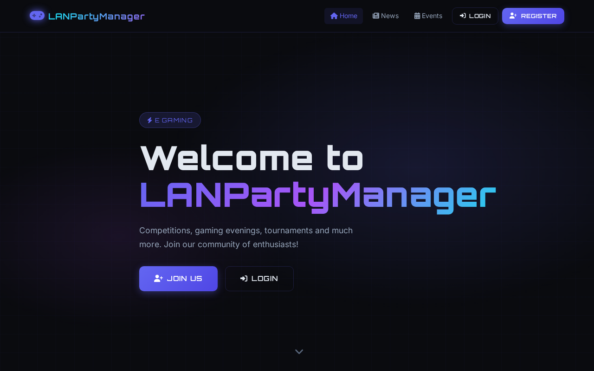
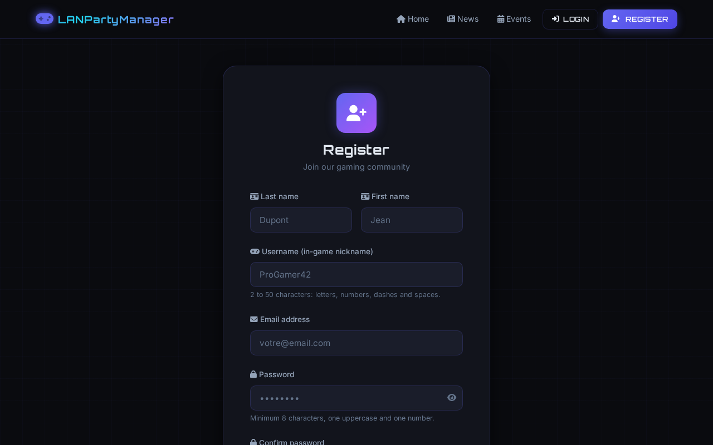

# LANPartyManager

> Portail web pour la gestion de LAN Party — événements, matchmaking, contrôle d'accès et classements en temps réel.

**Stack :** Node.js · Express · MySQL · EJS &nbsp;|&nbsp; **Thème :** Gaming dark/neon (responsive)

---

## Présentation

LANPartyManager est un portail complet pour organiser et animer des événements LAN. Il couvre l'ensemble du cycle de vie d'un événement, de l'inscription des participants jusqu'à l'affichage du classement final.

### Fonctionnalités principales

| Domaine | Fonctionnalités |
|---------|----------------|
| **Événements** | Création, planification et suivi d'état (planifié → en cours → terminé) |
| **Inscriptions** | Formulaire web + OAuth Discord · Badge QR code personnel |
| **Contrôle d'accès** | Scan de badge par les modérateurs pour valider l'entrée physique |
| **Rencontres** | Création par scan de badge + sélection du jeu · Attribution automatique de salle |
| **File d'attente** | Gestion FIFO automatique · Détection des conflits de joueurs |
| **Classement** | Suivi en temps réel des résultats et du classement par événement |
| **Notifications** | Intégration Discord (annonces, résultats) |
| **Administration** | Gestion complète des utilisateurs, jeux, salles et actualités |

---

## Captures d'écran

> 💡 Pour générer les captures depuis votre instance locale :
> ```bash
> APP_URL=http://localhost:3000 node scripts/capture-screenshots.js
> ```

### Page d'accueil



### Événements publics


### Actualités


### Inscription



### Dashboard administrateur


### Tableau de bord des rencontres


### Contrôle d'accès (scan de badge)


---

## Démarrage rapide

```bash
# 1. Importer database/install.sql dans PHPMyAdmin (ou via CLI)
# 2. Configurer les variables d'environnement
npm install
npm start
```

Pour l'installation complète, la configuration Discord et les variables d'environnement, voir [docs/INSTALLATION.md](docs/INSTALLATION.md).

---

## Documentation

| Document | Description |
|----------|-------------|
| [Installation & Configuration](docs/INSTALLATION.md) | Prérequis, variables d'environnement, démarrage, tests |
| [Architecture technique](docs/ARCHITECTURE.md) | Structure du projet, stack, modèle de données |
| [Guide d'utilisation](docs/USAGE.md) | Guide complet par profil (joueur, modérateur, admin) |
| [Configuration admin](docs/ADMIN_CONFIGURATION.md) | Configuration avancée depuis le panneau admin |
| [Journal des mises à jour](docs/UPDATES.md) | Historique des changements |
